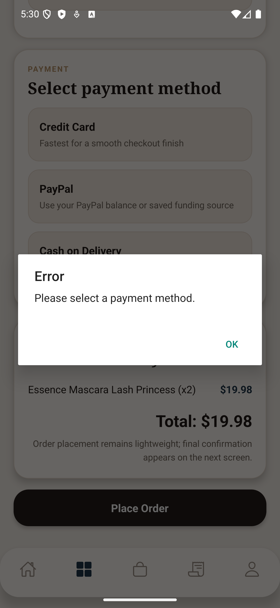
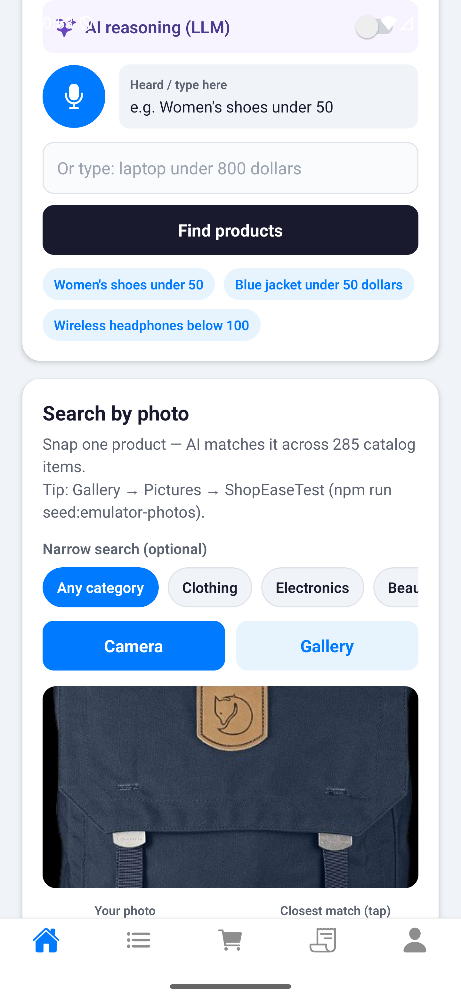
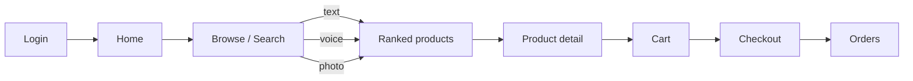
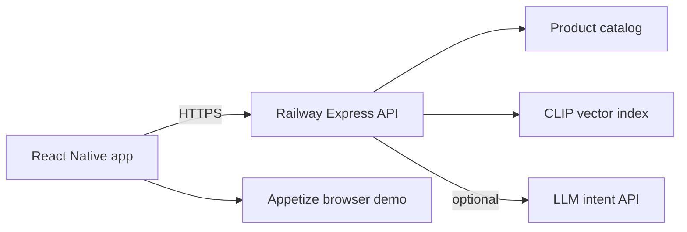

# ShopEase — AI-Powered Mobile Commerce Demo

A full-stack **React Native** shopping app: browse a live catalog, manage cart & checkout, track orders — plus **multimodal product search** (text, voice, and photo) powered by hybrid ranking and CLIP visual similarity.

**Stack:** React Native 0.85 · React 19 · Redux Toolkit · Express · CLIP · Railway (cloud API)

**Branch:** `main` · **Last updated:** 2026-07-06

---

## Quick assessment

Everything a reviewer needs from one page:

| | Resource |
|--|----------|
| **Try live (browser)** | [Appetize phone demo](https://appetize.io/app/b_syzdh2dfef37uy3fyeib33aky4?device=pixel7&osVersion=13.0&toolbar=true&scale=100) · Login `test@example.com` / `secret123` |
| **Watch — Android** | [App flow MP4](./docs/demo/videos/app-flow-demo.mp4) · [ML search MP4](./docs/demo/videos/ml-features-demo.mp4) |
| **Watch — iOS simulator** | [App flow (short)](./docs/demo/videos/ios/app-flow-demo-short.mp4) · [ML search (short)](./docs/demo/videos/ios/ml-features-demo-short.mp4) |
| **Screenshots** | [E2E gallery](./docs/e2e/README.md) |
| **5-minute demo script** | [DEMO_PRESENTATION.md](./docs/DEMO_PRESENTATION.md) |
| **Agentic development** | [AGENTIC_DEVELOPMENT.md](./docs/AGENTIC_DEVELOPMENT.md) · [Cursor agents](./AGENTS.md) |
| **Architecture & ML** | [ARCHITECTURE.md](./docs/ARCHITECTURE.md) · [ML_SEARCH.md](./docs/ML_SEARCH.md) |
| **CI/CD pipeline** | [GitHub Actions](https://github.com/kunalkachru/EcommerceAppFullStack/actions) · [CI quickstart](./scripts/lib/CI_CD_QUICKSTART.md) |
| **Full doc index** | [docs/README.md](./docs/README.md) |
| **Run locally (emulator / simulator)** | **[docs/LOCAL_RUN.md](./docs/LOCAL_RUN.md)** |
| **Test gates** | [TESTING_STATUS.md](./docs/TESTING_STATUS.md) — **85/85** Jest tests |

---

## Try the app (browser — no install)

The latest Android build deploys automatically from `main` to **Appetize**. Open it in your browser:

| Device | Link |
|--------|------|
| **Phone (Pixel 7)** | **[Open live demo →](https://appetize.io/app/b_syzdh2dfef37uy3fyeib33aky4?device=pixel7&osVersion=13.0&toolbar=true&scale=100)** |
| **Tablet** | [Open on Pixel Tablet →](https://appetize.io/app/b_syzdh2dfef37uy3fyeib33aky4?device=pixelTablet&osVersion=13.0&toolbar=true&scale=100) |

**Demo login:** `test@example.com` / `secret123`

---

## Watch it

Screen recordings from the app (each under 60 seconds). Click a screenshot to play the video.

| Commerce flow | Multimodal search |
|---------------|-------------------|
| [](./docs/demo/videos/app-flow-demo.mp4) | [](./docs/demo/videos/ml-features-demo.mp4) |
| **[▶ App flow demo](./docs/demo/videos/app-flow-demo.mp4)** (Android) | **[▶ ML features demo](./docs/demo/videos/ml-features-demo.mp4)** (Android) |

**Also on iOS simulator** (short cuts): [app flow](./docs/demo/videos/ios/app-flow-demo-short.mp4) · [ML search](./docs/demo/videos/ios/ml-features-demo-short.mp4)

<details>
<summary>Inline playback (may load slowly on GitHub)</summary>

<video src="./docs/demo/videos/app-flow-demo.mp4" controls width="320"></video>
<video src="./docs/demo/videos/ml-features-demo.mp4" controls width="320"></video>

</details>

More: [demo/videos/README.md](./docs/demo/videos/README.md) · [DEMO_PRESENTATION.md](./docs/DEMO_PRESENTATION.md)

---

## What ShopEase does

End-to-end **e-commerce** on mobile — not just search.

| Journey | What works today |
|---------|------------------|
| **Discover** | Home, categories, product list & detail (280+ products on live Railway API; merged local catalog up to ~389) |
| **Shop** | Add to cart from list or PDP, update quantities, remove items |
| **Checkout** | Shipping form, place order, order confirmation screen |
| **Account** | JWT login/signup, profile, persisted session |
| **Orders** | Order history tab with line items and status (`mocked_paid` — no real payment gateway) |

---

## Multimodal product search

ShopEase’s differentiator: find products the way people actually shop — not only by exact keywords.

| Mode | How it works |
|------|----------------|
| **Text** | Hybrid **lexical + semantic** ranking; handles price caps, product types, and jumbled phrasing (`240 under gaming monitor`, `fifty dollars jacket blue`) |
| **Voice** | On-device speech-to-text → same search API; optional **LLM intent extraction** (price, type, keywords) with rule-based fallback |
| **Photo** | **CLIP** compares your photo embedding to catalog image+text vectors; tap closest match → product detail |

Hybrid search evolved from a CLIP-only design: lexical candidates + semantic rerank + explicit constraints make noisy spoken and conversational queries much more reliable. Full pipeline: **[docs/ML_SEARCH.md](./docs/ML_SEARCH.md)**

---

## Architecture at a glance





| Layer | Technology |
|-------|------------|
| Mobile | React Native 0.85, React Navigation, Redux Toolkit |
| API | Express on Railway (auth, cart, orders, search) |
| Search | Hybrid lexical→semantic + CLIP image search |
| Demo deploy | GitHub Actions → APK → Appetize (stable URL) |

Deep dives: **[docs/README.md](./docs/README.md)** · **[docs/ARCHITECTURE.md](./docs/ARCHITECTURE.md)** · **[docs/DEPLOYMENT.md](./docs/DEPLOYMENT.md)**

---

## Built with agent-assisted development

This project was built by **Kunal Kachru** using LLM-assisted development (Cursor agents, Claude, Codex-style review) under human direction — specs, prompts, verification gates, and CI/CD integration.

| Layer | How agents helped |
|-------|-------------------|
| **Design** | Specs in [`docs/superpowers/`](./docs/superpowers/) → implementation plans |
| **Quality** | [`.cursor/agents/`](./.cursor/agents/) — E2E, Appetize CI, Railway, doc polish |
| **Proof** | 85 Jest tests, verify scripts, Maestro on emulator/simulator, GitHub Actions → Appetize |

Full guide: **[docs/AGENTIC_DEVELOPMENT.md](./docs/AGENTIC_DEVELOPMENT.md)** · Cursor index: **[AGENTS.md](./AGENTS.md)**

---

## For developers

Everything below is the technical reference: local setup, verification gates, CI/CD, and doc index.

### Quick start

```bash
npm install && cd server && npm install && cd ..
cp server/.env.example server/.env   # set JWT_SECRET
cp src/.env.example src/.env           # optional: OPENAI / OPENROUTER keys for live LLM (gitignored)
npm run server                       # Terminal 1 — API :5001
npm start                            # Terminal 2 — Metro :8081
npm run android                      # Terminal 3 — Android (see below for iOS)
```

| Platform | Deploy guide |
|----------|--------------|
| **Android emulator** | [SETUP § Android](./docs/SETUP.md#android-emulator-deployment) · [DEPLOYMENT § Android](./docs/DEPLOYMENT.md#android-emulator) |
| **iOS simulator** | [SETUP § iOS](./docs/SETUP.md#ios-simulator-deployment) · [DEPLOYMENT § iOS](./docs/DEPLOYMENT.md#ios-simulator) |

Full instructions: **[docs/SETUP.md](./docs/SETUP.md)** · Local runtime: **[docs/DEPLOYMENT.md](./docs/DEPLOYMENT.md)** · **Full verify + E2E:** **[docs/LOCAL_RUN.md](./docs/LOCAL_RUN.md)**

### Cloud demo & CI/CD

The API runs on **Railway**; the mobile demo APK auto-deploys to **Appetize** on push to `main`.

| Workflow | Trigger | Runner | Purpose |
|----------|---------|--------|---------|
| [API regression](.github/workflows/api-regression.yml) | push / PR | Ubuntu | Railway smoke + secrets policy |
| [Appetize demo deploy](.github/workflows/appetize-demo.yml) | push `main` | Ubuntu | Build APK → live browser demo |

[View GitHub Actions runs →](https://github.com/kunalkachru/EcommerceAppFullStack/actions)

| Topic | Document |
|-------|----------|
| **CI/CD — how to run & trigger workflows** | **[scripts/lib/CI_CD_QUICKSTART.md](./scripts/lib/CI_CD_QUICKSTART.md)** |
| **Deploy Railway, RAM settings** | **[docs/RAILWAY_DEPLOY.md](./docs/RAILWAY_DEPLOY.md)** |
| **Run verify / E2E scripts (Android + iOS)** | **[docs/LOCAL_RUN.md](./docs/LOCAL_RUN.md)** · [docs/CLOUD_REGRESSION.md](./docs/CLOUD_REGRESSION.md) |
| **Appetize / BrowserStack APK & upload** | **[docs/APPETIZE_BROWSERSTACK.md](./docs/APPETIZE_BROWSERSTACK.md)** |
| **Self-hosted OCI (optional)** | **[docs/OCI_DEPLOY.md](./docs/OCI_DEPLOY.md)** |

```bash
# Pre-push (same gate as GitHub Actions)
npm run verify:cloud:deploy-gate
npm run build:demo:apk

# Manual Appetize upload
npm run upload:appetize -- --platform android

# Trigger CI manually: GitHub → Actions → "Appetize demo deploy" → Run workflow
```

Quick cloud smoke: `npm run verify:cloud` · Full API gate: `npm run verify:cloud:all` · Deploy gate: `npm run verify:cloud:deploy-gate` · Live LLM: `npm run verify:cloud:llm` (needs local `src/.env`) · **Full local E2E:** `USE_CLOUD_API=1 npm run verify:e2e-all` — see **[docs/LOCAL_RUN.md](./docs/LOCAL_RUN.md)**

### Documentation index

| Document | Description |
|----------|-------------|
| **[docs/README.md](./docs/README.md)** | **Documentation hub** — by audience (portfolio, reviewers, developers) |
| **[docs/AGENTIC_DEVELOPMENT.md](./docs/AGENTIC_DEVELOPMENT.md)** | Agent-assisted workflow, subagents, spec-driven development |
| **[docs/LOCAL_RUN.md](./docs/LOCAL_RUN.md)** | **Local deploy, verification ladder, Maestro E2E** |
| **[docs/SETUP.md](./docs/SETUP.md)** | Prerequisites, install, 3-terminal startup, verification |
| **[docs/CONFIGURATION.md](./docs/CONFIGURATION.md)** | Env vars, API host, LLM keys, catalog, auth, permissions |
| **[docs/DEPLOYMENT.md](./docs/DEPLOYMENT.md)** | How the full stack runs today (local + Railway), architecture diagram |
| **[docs/RAILWAY_DEPLOY.md](./docs/RAILWAY_DEPLOY.md)** | Railway setup, RAM limits, CLI, troubleshooting |
| **[docs/CLOUD_REGRESSION.md](./docs/CLOUD_REGRESSION.md)** | **Verification & E2E scripts** — cloud API, Android emulator, iOS simulator |
| **[docs/TESTING_STATUS.md](./docs/TESTING_STATUS.md)** | **Complete testing & implementation status** — gates, results, review checklist |
| **[docs/HYBRID_SEARCH_TEST_STEPS.md](./docs/HYBRID_SEARCH_TEST_STEPS.md)** | Manual ML + E2E validation steps with expected outcomes |
| **[docs/DEMO_PRESENTATION.md](./docs/DEMO_PRESENTATION.md)** | Live demo script, talking points, reviewer checklist |
| **[docs/ARCHITECTURE.md](./docs/ARCHITECTURE.md)** | System architecture (client, API, data flow) |
| **[docs/ML_SEARCH.md](./docs/ML_SEARCH.md)** | Multimodal search pipelines (text, voice, CLIP) |
| [docs/demo/videos/README.md](./docs/demo/videos/README.md) | Demo screen recordings (app flow + ML) |
| [docs/E2E_TEST_MATRIX.md](./docs/E2E_TEST_MATRIX.md) | Maestro E2E scenario matrix |
| [docs/test-photos/README.md](./docs/test-photos/README.md) | Visual-search test photo guide |
| [docs/e2e/README.md](./docs/e2e/README.md) | Screenshot gallery index |

### Project status (summary)

| Area | Status |
|------|--------|
| Cart / add-to-cart | ✅ Reliable (list + PDP, structured errors) |
| Text / voice / image search | ✅ Hybrid runtime + baseline comparison + LLM reasoning + fallbacks |
| Jumbled / conversational queries | ✅ Hybrid fixes reversed-range and price-first edge cases |
| Orders | ✅ Lightweight (`mocked_paid`, Orders tab) |
| Payment gateway | ❌ Not integrated |
| Cloud production deploy | ✅ Railway (Hobby) — see [RAILWAY_DEPLOY.md](./docs/RAILWAY_DEPLOY.md) |
| Cloud regression scripts | ✅ [CLOUD_REGRESSION.md](./docs/CLOUD_REGRESSION.md) |

**Full detail:** [docs/TESTING_STATUS.md](./docs/TESTING_STATUS.md)

### Testing status (current gates)

Run with API server up (`npm run server`) after CLIP index finishes, **or** against Railway — see **[docs/CLOUD_REGRESSION.md](./docs/CLOUD_REGRESSION.md)**.

| Command | Expected result |
|---------|-----------------|
| `npm test -- --watchman=false --runInBand --forceExit` | **85/85** tests (27 suites) |
| `npm run verify:search` | **20/20** search flow checks |
| `npm run verify:ml` | **13/13** ML + catalog checks |
| `npm run verify:cloud:all` | Cloud API + CLIP + ML + search (Railway) |
| `npm run verify:cloud:llm` | Live LLM reasoning vs Railway (`src/.env` keys, not in repo) |
| `npm run verify:secrets-policy` | Scan git-tracked files for accidental API key commits |
| `npm run build:demo:apk` | Release APK for Appetize / BrowserStack (cloud API embedded) |
| `npm run build:demo:ios-sim` | iOS simulator zip for Appetize (macOS) |
| `npm run upload:appetize` | Upload build via Appetize API (`APPETIZE_API_TOKEN` in `src/.env`) |
| `npm run upload:browserstack` | Upload APK to BrowserStack App Live |
| `npm run verify:e2e-android:cloud` | Android commerce E2E vs cloud |
| `IOS_FRESH_SIM=1 npm run verify:e2e-ios:cloud` | iOS Maestro E2E vs cloud |
| `npm run verify:search:hybrid` | Hybrid passes all hybrid fixtures; baseline-only gaps shown for comparison |
| `npm run verify:llm-local` | Optional local Ollama smoke test for the LLM path (no paid credits; model quality may vary) |
| `npm run verify:llm-live` | Live OpenAI/OpenRouter intent extraction (keys in `src/.env`; run with `API_URL=http://127.0.0.1:5002` for hybrid) |

Catalog: **>=200 products required** · live Railway API: **280+** (varies with upstream APIs) · merged local catalog up to **~389** · Demo coverage products: **6**

### Repository layout

```
├── src/                    # React Native app (screens, components, redux, services)
├── server/                 # Express API (auth, cart, orders, search, CLIP)
├── __tests__/              # Jest unit/integration tests
├── scripts/                # verify:search, verify:ml, snapshot-catalog, seed photos
├── docs/                   # All project documentation (see index above)
└── android/ ios/           # Native project files
```

#### Key server modules

| File | Role |
|------|------|
| `server/src/index.js` | Auth, cart, orders, route wiring |
| `server/src/catalogService.js` | Merged catalog + demo coverage |
| `server/src/naturalSearch.js` | Semantic text/voice search |
| `server/src/voiceQueryLLM.js` | LLM intent extraction |
| `server/src/voiceQueryParser.js` | Rule-based intent fallback |
| `server/src/visualSearch.js` | CLIP image search |

#### Key client modules

| File | Role |
|------|------|
| `src/config/api.js` | API base URL (emulator vs simulator) |
| `src/redux/cartSlice.jsx` | Cart state + errors |
| `src/services/catalogSearchService.js` | Search orchestration |
| `src/components/VoiceSearchCard.jsx` | Voice + LLM UI |
| `src/screens/OrdersScreen.jsx` | Order history |

### npm scripts

| Script | Description |
|--------|-------------|
| `npm start` | Metro bundler |
| `npm run android` / `ios` | Run mobile app |
| `npm run server` | Start API on port 5001 |
| `npm run server:hybrid` | Start hybrid search API on port 5002 |
| `npm test` | Jest test suite |
| `npm run verify:search` | Search flow verification (20 checks) |
| `npm run verify:ml` | ML + catalog verification (13 checks) |
| `npm run verify:search:hybrid` | Side-by-side baseline vs hybrid verification |
| `npm run verify:llm-local` | Optional local-Ollama LLM smoke verification |
| `npm run verify:llm-live` | **Live LLM reasoning** (requires keys in `src/.env`) |
| `npm run verify:cloud` | Cloud commerce smoke (Railway) |
| `npm run verify:cloud:all` | Full cloud API regression |
| `npm run verify:e2e-android:cloud` | Android E2E vs cloud |
| `npm run verify:e2e-ios:cloud` | iOS Maestro E2E vs cloud |
| `npm run snapshot-catalog` | Refresh offline catalog JSON |
| `npm run seed:emulator-photos` | Seed test photos to Android emulator |
| `npm run record:demo:android` | Record both demo videos (Android emulator → `docs/demo/videos/`) |
| `npm run record:demo:ios` | Record both demo videos (iOS simulator → same two files) |

### Configuration

| What | Where |
|------|-------|
| Server env | `server/.env` (from `server/.env.example`) |
| Client LLM keys | `src/.env` (gitignored, optional) |
| API host override | `src/config/api.js` or `global.__API_HOST__` |

Full reference: **[docs/CONFIGURATION.md](./docs/CONFIGURATION.md)**

### External review checklist (Codex / Claude)

1. Read this README, then **[docs/TESTING_STATUS.md](./docs/TESTING_STATUS.md)**
2. Run the verification commands above, starting with **`npm run verify:llm-local`** for no-cost validation and **`npm run verify:llm-live`** only when paid-provider keys are available
3. Review key files listed in TESTING_STATUS “Key Files for Code Review”
4. Confirm no secrets in git (`src/.env`, `server/.env` are gitignored)

---

## License

Licensed under the [MIT License](LICENSE).

Copyright © 2026 Kunal Kachru. Built with agent-assisted development — see [docs/AGENTIC_DEVELOPMENT.md](./docs/AGENTIC_DEVELOPMENT.md).
