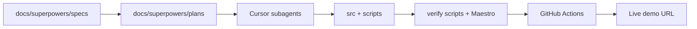

# Agent-assisted development

**Last updated:** 2026-07-06

ShopEase was built by **Kunal Kachru** using LLM-assisted development: human-directed prompts, design specs, verification gates, and specialized Cursor subagents — not unattended code generation.

> **Navigation:** [README](../README.md) · [Docs hub](./README.md) · [superpowers specs](./superpowers/README.md) · [AGENTS.md](../AGENTS.md)

---

## What this repo demonstrates

| Capability | Evidence in repo |
|------------|------------------|
| **Product engineering** | Full-stack RN app + Express API + CLIP/LLM search |
| **Agent orchestration** | [`.cursor/agents/`](../.cursor/agents/) subagents for E2E, CI, Railway, reviews |
| **Spec-driven workflow** | [`docs/superpowers/specs/`](./superpowers/specs/) → plans → implementation on `main` |
| **Automated quality gates** | Jest (85 tests), verify scripts, Maestro E2E, GitHub Actions |
| **Live demo pipeline** | Push to `main` → Railway gate → APK build → Appetize |

Tools used: **Cursor** (agents, rules), **Claude** / **Codex-style** review loops, local emulator/simulator automation.

---

## Workflow

1. **Spec** — problem, constraints, success criteria (`docs/superpowers/specs/`)
2. **Plan** — bite-sized tasks (`docs/superpowers/plans/`)
3. **Implement** — agent or human edits with minimal scope
4. **Verify** — `npm test`, `verify:*`, Maestro on emulator/simulator
5. **Deploy** — Railway API + Appetize CI (Ubuntu only; zero macOS on push)

---

## Cursor subagents

| Agent | File | Role |
|-------|------|------|
| **e2e-testing** | [`.cursor/agents/e2e-testing.md`](../.cursor/agents/e2e-testing.md) | Maestro + Android/iOS emulator gates |
| **appetize-cicd** | [`.cursor/agents/appetize-cicd.md`](../.cursor/agents/appetize-cicd.md) | Appetize workflow, secrets, upload |
| **railway-ops** | [`.cursor/agents/railway-ops.md`](../.cursor/agents/railway-ops.md) | Railway deploy and env |
| **review-fixes** | [`.cursor/agents/review-fixes.md`](../.cursor/agents/review-fixes.md) | Post-review hygiene, zero-cost CI |
| **oci-ops** | [`.cursor/agents/oci-ops.md`](../.cursor/agents/oci-ops.md) | Optional self-hosted API |
| **docs-showcase** | [`.cursor/agents/docs-showcase.md`](../.cursor/agents/docs-showcase.md) | Public docs polish and link checks |

Invoke in Cursor: *"Use the e2e-testing subagent to …"* or rely on agent descriptions for proactive delegation.

---

## Flagship design specs

| Spec | Topic |
|------|-------|
| [2026-07-01-hybrid-search-redesign-design.md](./superpowers/specs/2026-07-01-hybrid-search-redesign-design.md) | Hybrid lexical + semantic search |
| [2026-07-04-e2e-testing-design.md](./superpowers/specs/2026-07-04-e2e-testing-design.md) | Maestro E2E matrix |
| [2026-07-05-appetize-cicd-design.md](./superpowers/specs/2026-07-05-appetize-cicd-design.md) | GitHub Actions → Appetize |
| [2026-07-05-readme-product-first-design.md](./superpowers/specs/2026-07-05-readme-product-first-design.md) | Product-first README |

---

## Human responsibilities

Agents accelerate implementation; the maintainer retains:

- Architecture and scope decisions
- Secret management (GitHub Secrets, gitignored `src/.env`)
- Review of agent output before merge
- Verification command interpretation (PASS/FAIL/WARN)
- Cost constraints (hobby project: no macOS CI on every push)

---

## Related

- [TESTING_STATUS.md](./TESTING_STATUS.md) — gate results and review checklist
- [CLOUD_REGRESSION.md](./CLOUD_REGRESSION.md) — verify and E2E commands
- [CI_CD_QUICKSTART.md](../scripts/lib/CI_CD_QUICKSTART.md) — pipeline triggers
