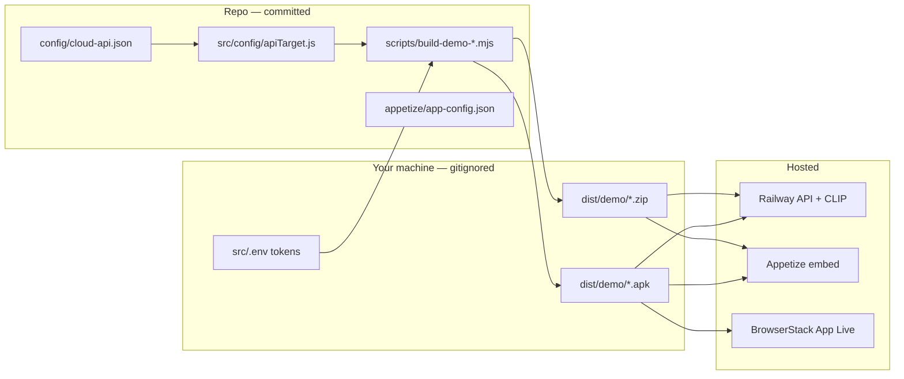

# Appetize & BrowserStack — demo builds

**Last updated:** 2026-07-06

**TL;DR:** Push to `main` → GitHub Actions builds Android APK → uploads to [Appetize live demo](https://appetize.io/app/b_syzdh2dfef37uy3fyeib33aky4). Secrets: `APPETIZE_API_TOKEN` + `APPETIZE_PUBLIC_KEY_ANDROID` in GitHub Actions only. **Start here:** [CI_CD_QUICKSTART.md](../scripts/lib/CI_CD_QUICKSTART.md).

Ship a **standalone mobile build** (JS embedded, no Metro) that talks to the **Railway cloud API**. Upload to [Appetize](https://appetize.io) for a browser-shareable demo or [BrowserStack App Live](https://www.browserstack.com/app-live) for real-device QA.

Related: [RAILWAY_DEPLOY.md](./RAILWAY_DEPLOY.md) · [CLOUD_REGRESSION.md](./CLOUD_REGRESSION.md) · [CONFIGURATION.md](./CONFIGURATION.md)

---

## GitHub vs Appetize — what is (and is not) connected

**Short answer:** CI/CD reads **GitHub Actions secrets only** (never `src/.env`). Push to `main` builds and uploads to Appetize when secrets are configured.

| | In GitHub repo (committed) | GitHub Actions secrets | Local `src/.env` (gitignored) | Appetize / Railway |
|---|---------------------------|------------------------|-------------------------------|---------------------|
| **Build scripts** | ✓ `scripts/build-demo-*.mjs` | — | — | — |
| **Upload script** | ✓ `scripts/upload-appetize.mjs` | runs in CI | runs locally | receives APK |
| **Appetize metadata** | ✓ `appetize/app-config.json` | — | — | stores app |
| **`APPETIZE_API_TOKEN`** | ✗ never | ✓ **required** | optional mirror | ✗ never |
| **`APPETIZE_PUBLIC_KEY_*`** | public URL in config | ✓ **ANDROID required** | optional mirror | public key |
| **LLM API keys** | ✗ never | ✗ never in CI | optional dev tests | ✗ never in build |
| **APK / zip** | ✗ never (`dist/` gitignored) | built on runner | built locally | runs here |
| **Railway API URL** | ✓ `config/cloud-api.json` | — | — | Railway service |
| **GitHub Actions CI** | ✓ `.github/workflows/appetize-demo.yml` | secrets injected | — | upload target |

### What “repo-integrated” means here

The **workflow, scripts, and secret names** live in the repo. **CI/CD credentials come from GitHub Actions secrets only.** Local `src/.env` is an optional mirror for developers — never used in CI.

It does **not** mean:

- Appetize reads from your GitHub repository
- The mobile app on Appetize reads `src/.env` from GitHub

### Typical flow

**CI (production path):**

```text
push main → GitHub Secrets → preflight → build APK → upload Appetize (stable URL)
```

**Local (optional mirror of secrets):**

```text
git clone → cp src/.env.example src/.env → npm run build:demo:apk → npm run upload:appetize
```

### Railway vs Appetize vs GitHub (three separate links)

| Service | Typical GitHub link | This project |
|---------|---------------------|--------------|
| **Railway** | Often deploys `server/` on `git push` to `main` | API hosted on Railway; may be wired in Railway dashboard (outside this doc) |
| **Appetize** | GitHub Actions on push / manual | Upload via secrets; stable public URL |
| **GitHub repo** | Source code only | Scripts + config; no Appetize token in git |

Changes to **mobile bundle inputs** on **`main`** (`src/`, `android/`, `ios/`, `config/`, RN config — not docs or E2E-only scripts) trigger [`.github/workflows/appetize-demo.yml`](../.github/workflows/appetize-demo.yml): Railway deploy gate → build APK → **automatic Appetize upload**. Path list: **[CI_CD_QUICKSTART.md](../scripts/lib/CI_CD_QUICKSTART.md)** § Path filters.

### LLM keys — same rule on Appetize

Public users on the Appetize link paste **their own** LLM key in the app UI. Nothing from `src/.env` ships in the build. See [CONFIGURATION.md](./CONFIGURATION.md) § LLM key policy.

---

## Architecture



| Layer | What runs | Secrets |
|-------|-----------|---------|
| Mobile build | Embedded bundle → Railway HTTPS | None in APK/IPA |
| Railway | Commerce + CLIP + search | `JWT_SECRET` in Railway dashboard |
| Live LLM | User pastes key in app UI | Optional `src/.env` for local verify only |
| Upload | Appetize / BS API | `APPETIZE_API_TOKEN`, BS creds in `src/.env` |

---

## Prerequisites

1. **Railway API live enough for demo smoke** — `npm run verify:cloud` green. The stricter parity target remains `npm run verify:cloud:all`, which may still fail on catalog-size/enrichment drift until Railway catches up.
2. **Cloud app target selected via wrapper scripts** (checked automatically); repo default stays local in `config/app-target.json`.
3. **Cloud host** in `config/cloud-api.json` (single source for app + scripts).
4. **Optional upload tokens** in `src/.env` (see `src/.env.example`).

---

## First time on Appetize (step-by-step)

Appetize runs your **APK or iOS sim zip in a browser** — like a remote phone. Your API stays on **Railway**; the app on Appetize calls it over HTTPS. **No LLM keys are in the build** — you paste your own in the app after it loads.

### Step 1 — Create an Appetize account

1. Go to [appetize.io](https://appetize.io) and sign up (free tier works for demos).
2. Optional: note your **API token** under [Settings → API](https://appetize.io/app/settings/api) if you want CLI upload later.

### Step 2 — Build the APK on your Mac

```bash
cd /path/to/EcommerceAppFullStack
npm install && cd server && npm install && cd ..

# Confirm Railway is up and app targets cloud
npm run verify:demo-build-ready

# Build (needs ~4 GB free disk; single-ABI if tight on space)
DEMO_APK_ABIS=arm64-v8a npm run build:demo:apk
```

Output: **`dist/demo/shopease-cloud-demo.apk`**

(iOS: `npm run build:demo:ios-sim` on macOS → `dist/demo/shopease-cloud-demo-ios-sim.zip`)

### Step 3 — Upload (pick one)

**A — Dashboard (easiest for beginners)**

1. Open [appetize.io/upload](https://appetize.io/upload).
2. Choose **Android** → drag **`shopease-cloud-demo.apk`**.
3. Wait for processing (1–3 min).
4. Copy the **public link** — looks like `https://appetize.io/app/XXXXXXXXXX`.

**B — CLI (optional)**

```bash
# Add to src/.env (never commit):
# APPETIZE_API_TOKEN=your_token_from_appetize_settings

npm run upload:appetize -- --platform android
```

The script prints the public URL and embed snippet.

### Step 4 — Try the demo in the browser

1. Open your Appetize link.
2. Allow **camera / microphone** if prompted (photo + voice search).
3. **Log in:** `test@example.com` / `secret123`
4. Browse products, try photo search (CLIP on Railway).
5. For **live LLM reasoning:** open Voice Search → enable AI reasoning → **paste your own** OpenAI/OpenRouter key → search.

If catalog loads but CLIP is slow, wait ~1 min (Railway index warm-up) or run `npm run verify:cloud:clip` from your laptop.

### Step 5 — Share

- **Link:** `https://appetize.io/app/YOUR_PUBLIC_KEY`
- **Embed** (portfolio / README):

```html
<iframe
  src="https://appetize.io/embed/YOUR_PUBLIC_KEY?device=pixel7&scale=75&autoplay=true"
  width="378" height="800"
  frameborder="0"
  allow="camera; microphone"
></iframe>
```

Paste `YOUR_PUBLIC_KEY` into `appetize/app-config.json` → `publicKeys.android` if you want it documented for your team (URLs are not secret).

---

## GitHub Actions → Appetize (enabled)

**Quick reference:** [scripts/lib/CI_CD_QUICKSTART.md](../scripts/lib/CI_CD_QUICKSTART.md)  
**Workflow:** [`.github/workflows/appetize-demo.yml`](../.github/workflows/appetize-demo.yml)

**Live demo:** https://appetize.io/app/b_syzdh2dfef37uy3fyeib33aky4

### Trigger matrix (zero macOS cost by default)

| Trigger | Preflight | Android → Appetize | iOS macOS |
|---------|-----------|-------------------|-----------|
| Push `main` | `verify:cloud:deploy-gate` | ✓ | ✗ |
| Manual dispatch | same | ✓ | only if `include_ios` checked |
| Pull request | skipped | APK artifact only | ✗ |

### GitHub Secrets

| Secret | Value / notes |
|--------|----------------|
| `APPETIZE_API_TOKEN` | From [Appetize API settings](https://appetize.io/app/settings/api) — **required** |
| `APPETIZE_PUBLIC_KEY_ANDROID` | `b_syzdh2dfef37uy3fyeib33aky4` — **required** |
| `APPETIZE_PUBLIC_KEY_IOS` | Optional — after first manual iOS upload |

### Deploy gate (intelligent retry)

`npm run verify:cloud:deploy-gate` runs `verify:cloud:all` with `CLIP_WAIT_MS=600000` and **one retry** for transient failures (502, CLIP indexing, network). **Blocking** failures (health, auth, wrong API target) stop deploy immediately.

LLM keys are **never** in CI or the APK.

### Device / form factor on Appetize

Change the URL device param — no rebuild:

- Phone: `?device=pixel7&osVersion=13.0`
- Tablet: `?device=pixelTablet&osVersion=13.0`

---

| Platform | Command | Output | Appetize | BrowserStack |
|----------|---------|--------|----------|--------------|
| Android | `npm run build:demo:apk` | `dist/demo/shopease-cloud-demo.apk` | ✓ APK | ✓ APK |
| iOS sim | `npm run build:demo:ios-sim` | `dist/demo/shopease-cloud-demo-ios-sim.zip` | ✓ sim zip | Prefer Android or signed device IPA |

Both builds **embed the JS bundle** — reviewers do **not** need Metro.

Pre-flight (local, same as CI):

```bash
npm run verify:cloud:deploy-gate   # API + CLIP + ML + search, smart retry
# or quick smoke only:
npm run verify:demo-build-ready    # cloud target + Railway health
```

Full local build:

```bash
npm run build:demo:apk            # ~2–5 min
npm run build:demo:ios-sim          # macOS + Xcode only
# or
npm run build:demo:all
```

**Signing:** Android release uses the debug keystore (demo only). iOS sim build skips code signing. Production store builds are out of scope for this doc.

---

## Demo login & LLM

| Item | Value |
|------|--------|
| Test user | `test@example.com` / `secret123` |
| LLM keys | **Not** in the build — paste in Voice Search card on device |
| CLIP / catalog | Served from Railway |

After upload, wait ~30s for Railway CLIP index if visual search returns empty (`npm run verify:cloud:clip`).

---

## Appetize integration

### 1. Manual upload (fastest)

1. Build APK or iOS sim zip (above).
2. [Appetize dashboard](https://appetize.io/upload) → upload file.
3. Copy **public key** → share `https://appetize.io/app/<publicKey>`.

### 2. API upload (local or CI)

The upload script runs locally or in GitHub Actions via `appetize-demo.yml`.

Add to local `src/.env` (never commit) or GitHub Secrets:

```bash
APPETIZE_API_TOKEN=your_token   # https://appetize.io/app/settings/api
```

```bash
npm run upload:appetize -- --platform android
npm run upload:appetize -- --platform ios
npm run upload:appetize -- --platform android --note "Demo after deploy abc123"
```

Paste returned `publicKey` into `appetize/app-config.json` → `publicKeys` for team reference (URLs are not secret).

### 3. Embed in README / portfolio

```html
<iframe
  src="https://appetize.io/embed/PUBLIC_KEY?device=pixel7&scale=75&autoplay=true"
  width="378" height="800"
  frameborder="0"
  allow="camera; microphone"
></iframe>
```

Grant camera/mic in the Appetize UI for photo/voice search demos.

### Repo files

| File | Purpose |
|------|---------|
| `appetize/app-config.json` | Platform IDs, artifact paths, upload commands |
| `config/cloud-api.json` | Railway host (app + scripts) |
| `scripts/build-demo-apk.mjs` | Release APK |
| `scripts/build-demo-ios-sim.mjs` | Simulator .app.zip |
| `scripts/upload-appetize.mjs` | REST upload |
| `dist/demo/.gitkeep` | Placeholder; binaries gitignored |

---

## BrowserStack integration

Add to `src/.env`:

```bash
BROWSERSTACK_USERNAME=your_user
BROWSERSTACK_ACCESS_KEY=your_key
```

```bash
npm run build:demo:apk
npm run upload:browserstack
```

Use returned `app_url` in App Live. For iOS on BrowserStack, build a **signed device IPA** (TestFlight / ad-hoc) — the simulator zip is Appetize-oriented.

---

## Release checklist (Appetize / BS)

```bash
# 1) Backend
npm run verify:cloud:all
npm run verify:cloud:clip

# 2) Mobile config
npm run verify:demo-build-ready

# 3) Build
npm run build:demo:apk
# npm run build:demo:ios-sim   # macOS

# 4) Smoke on device/emulator (optional)
npm run verify:e2e-android:cloud

# 5) Upload
npm run upload:appetize -- --platform android
# npm run upload:browserstack

# 6) Manual on Appetize: login → browse → photo search → voice (paste LLM key)
```

---

## Changing the Railway URL

Edit **`config/cloud-api.json`** only, then rebuild the mobile app:

```json
{
  "host": "your-new-service.up.railway.app",
  "useHttps": true,
  "searchRuntime": "baseline"
}
```

Re-run `npm run build:demo:apk` and re-upload to Appetize/BrowserStack.

---

## Troubleshooting

| Issue | Fix |
|-------|-----|
| App can't reach API | Confirm `config/cloud-api.json` host; rebuild; Railway `/health` |
| **Instant crash on launch (Appetize)** | APK was **arm64-only** — rebuild: `npm run build:demo:apk` (includes `x86_64`) and re-upload. |
| **Login fails on Appetize but works on emulator** | Old builds hit `http://10.0.2.2:5001` instead of Railway — pull latest, rebuild APK, re-upload. Test user: `test@example.com` / `secret123`. |
| Blank screen on Appetize | Use **release** build scripts (not debug + Metro) |
| CLIP empty | Wait for index; `npm run verify:cloud:clip` |
| Gradle fails | Free disk space (~4 GB for release); or `DEMO_APK_ABIS=arm64-v8a npm run build:demo:apk` |
| Gradle OOM / ninja | Same — single ABI build; `cd android && ./gradlew clean` |
| iOS pod errors | `cd ios && pod install` |
| Upload 401 | Regenerate Appetize token / BS access key in dashboard |
| LLM search fails | Expected without user key — paste in Voice Search UI |

---

## What is NOT in git

- `dist/demo/*.apk`, `*.zip` — build locally
- `src/.env` — upload tokens, LLM keys
- Appetize/BrowserStack credentials

Run `npm run verify:secrets-policy` before pushing.
