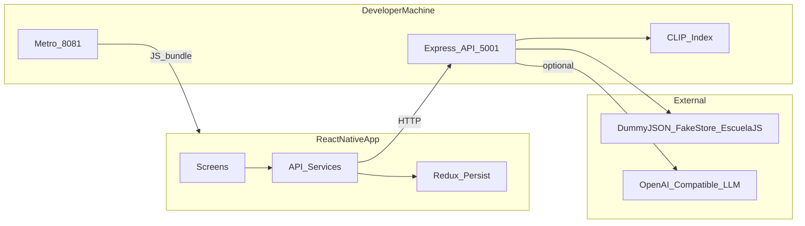
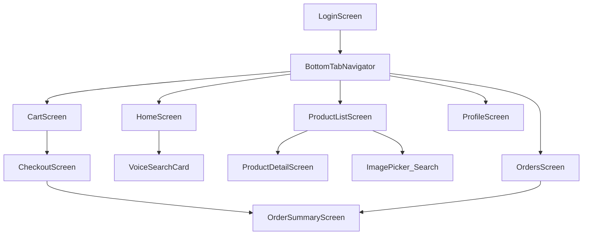
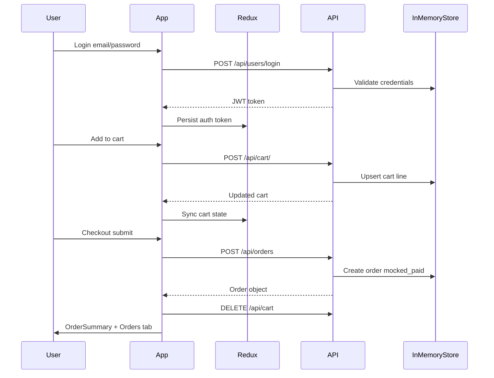
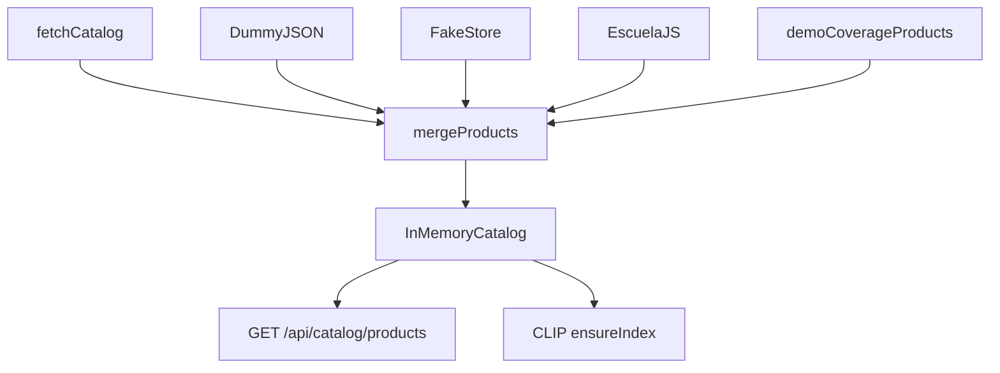

# Architecture

**Last updated:** 2026-07-01

System design and data flows for the ShopEase full-stack e-commerce demo.

> **Navigation:** [README](../README.md) · [ML Search](./ML_SEARCH.md) · [Demo Presentation](./DEMO_PRESENTATION.md) · [Setup](./SETUP.md)

---

## System context

The app runs as a **local full-stack demo**: React Native client, Metro bundler, and Express API on the developer machine. Cloud deployment is not configured yet — see [DEPLOYMENT.md](./DEPLOYMENT.md).

### Layers

| Layer | Technology | Responsibility |
|-------|------------|----------------|
| Mobile UI | React Native 0.85, React Navigation | Screens, tabs, search UI, cart UX |
| Client state | Redux Toolkit + redux-persist | Auth token, cart, catalog cache |
| API client | Axios (`src/services/apiClient.js`) | JWT auth, base URL per platform |
| Backend | Express (`server/src/index.js`) | Auth, cart, orders, search routes |
| Catalog | `server/src/catalogService.js` | Merge public APIs + demo coverage products |
| Search | `naturalSearch.js`, `visualSearch.js` | CLIP embeddings + intent constraints |
| Index | `@xenova/transformers` CLIP | In-memory product vectors (~385 items) |

---

## Navigation structure

---

## Commerce data flow

End-to-end purchase path from login through order history.

### Key files

| Concern | File |
|---------|------|
| Cart state + errors | [src/redux/cartSlice.jsx](../src/redux/cartSlice.jsx) |
| Add-to-cart UI | [src/screens/ProductListScreen.jsx](../src/screens/ProductListScreen.jsx), [src/screens/ProductDetailScreen.jsx](../src/screens/ProductDetailScreen.jsx) |
| Checkout + order create | [src/screens/CheckoutScreen.jsx](../src/screens/CheckoutScreen.jsx) |
| Orders list | [src/screens/OrdersScreen.jsx](../src/screens/OrdersScreen.jsx) |
| Server routes | [server/src/index.js](../server/src/index.js) |
| Orders client | [src/services/ordersService.js](../src/services/ordersService.js) |

---

## Catalog pipeline

Demo coverage products fill search gaps (e.g. laptops $500–900, gaming monitors under $240). See [server/src/demoCoverageProducts.js](../server/src/demoCoverageProducts.js).

---

## API surface (summary)

| Endpoint | Auth | Purpose |
|----------|------|---------|
| `POST /api/users/register` | No | Create account |
| `POST /api/users/login` | No | JWT login |
| `GET /api/catalog/products` | No | Merged product catalog |
| `POST /api/cart/` | Yes | Add line item |
| `GET /api/cart` | Yes | Fetch cart |
| `POST /api/orders` | Yes | Create order from checkout |
| `GET /api/orders` | Yes | List user orders |
| `POST /api/search/voice` | Optional | Text/voice natural search |
| `POST /api/visual-search` | No | Photo search |

Full search architecture: [ML_SEARCH.md](./ML_SEARCH.md)

---

## Persistence model (local demo)

| Data | Storage | Survives API restart? |
|------|---------|----------------------|
| Users, carts, orders | In-memory server store | No |
| Auth token, cart (client) | AsyncStorage via Redux Persist | Yes (on device) |
| Catalog | Refetched + merged on server start | Refetched |
| CLIP vectors | Built in memory on server start | Rebuilt |

---

## Related docs

- [ML_SEARCH.md](./ML_SEARCH.md) — voice, text, and photo search pipelines
- [CONFIGURATION.md](./CONFIGURATION.md) — env vars and API host
- [TESTING_STATUS.md](./TESTING_STATUS.md) — test gates and results
- [DEMO_PRESENTATION.md](./DEMO_PRESENTATION.md) — live demo script
