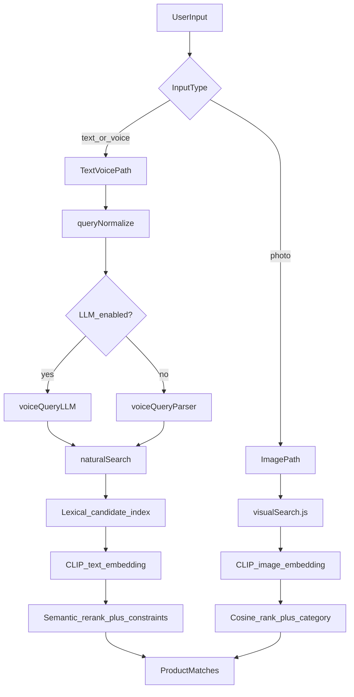
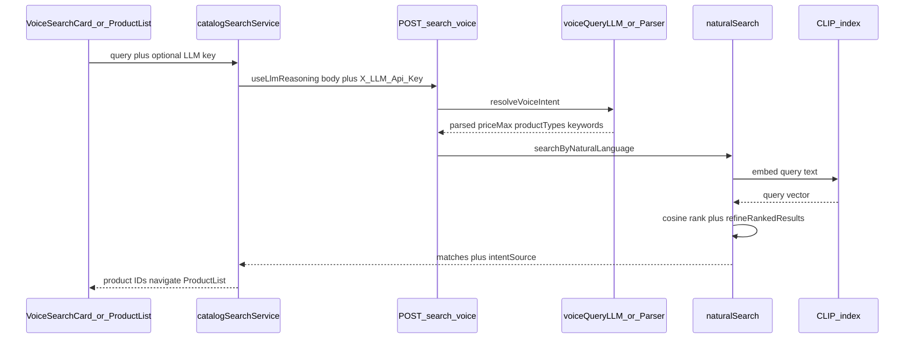
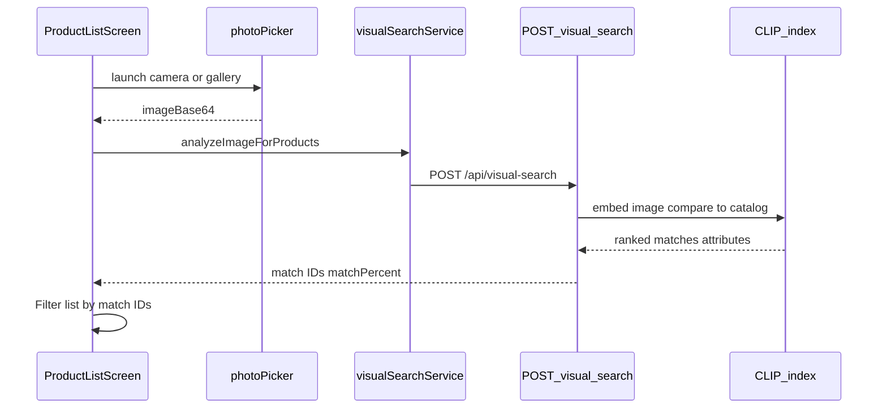
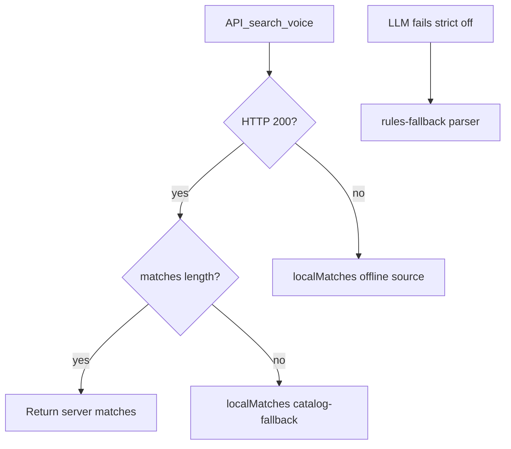

# ML Search Architecture

**Last updated:** 2026-07-01

Voice, text, and photo search pipelines — design and data flow.

> **Navigation:** [README](../README.md) · [Architecture](./ARCHITECTURE.md) · [Demo Presentation](./DEMO_PRESENTATION.md)

---

## Overview

Search supports three input modes that share a unified ranking philosophy:

1. **Typed text** — product list search bar or Home smart search
2. **Voice** — speech-to-text on device, then same API as text
3. **Photo** — camera/gallery image sent as base64 to CLIP visual search

Text/voice now supports two runtime modes:

1. **Baseline** — semantic-first CLIP ranking
2. **Hybrid** — lexical candidate generation, semantic rerank, and structured constraints

Photo search still uses CLIP image embeddings, but the hybrid runtime can reuse text-style fallback logic when the image pipeline needs a safer best-effort result.

---

## Unified multimodal pipeline

---

## Text / voice search flow

### Intent layers

| Layer | File | When used |
|-------|------|-----------|
| Normalization | [server/src/search/intent/queryNormalizer.js](../server/src/search/intent/queryNormalizer.js) | Spelled numbers, comparators, reversed phrasing |
| LLM intent | [server/src/search/intent/llmIntentResolver.js](../server/src/search/intent/llmIntentResolver.js) | `useLlmReasoning=true` + provider |
| Rule parser | [server/src/search/intent/ruleIntentResolver.js](../server/src/search/intent/ruleIntentResolver.js) | LLM off or fallback |
| Lexical retrieval | [server/src/search/text/lexicalCatalogIndex.js](../server/src/search/text/lexicalCatalogIndex.js) | Candidate generation for jumbled/product-first phrasing |
| Semantic rerank | [server/src/search/text/semanticTextReranker.js](../server/src/search/text/semanticTextReranker.js) | CLIP + type/price refinement |
| Orchestrator | [server/src/search/text/searchTextCatalog.js](../server/src/search/text/searchTextCatalog.js) | Baseline vs hybrid text runtime |

### Client entry points

| UI | Service | Notes |
|----|---------|-------|
| [VoiceSearchCard.jsx](../src/components/VoiceSearchCard.jsx) | [voiceSearchService.js](../src/services/voiceSearchService.js) | Mic + LLM provider config |
| [ProductListScreen.jsx](../src/screens/ProductListScreen.jsx) | [catalogSearchService.js](../src/services/catalogSearchService.js) | Debounced text search |
| [HomeScreen.jsx](../src/screens/HomeScreen.jsx) | [catalogSearchService.js](../src/services/catalogSearchService.js) | Smart search navigation |

---

## Photo search flow

### Visual search features

| Feature | Endpoint | File |
|---------|----------|------|
| Photo search | `POST /api/visual-search` | [visualSearch.js](../server/src/visualSearch.js) |
| Similar products (PDP) | `GET /api/visual-search/similar/:id` | Same |
| Category narrow | `categoryFilter` body param | [VisualSearchCategoryPrompt.jsx](../src/components/VisualSearchCategoryPrompt.jsx) |

---

## Demo use cases

Validated queries for presentations and regression checks.

### Text / voice (LLM or rules)

| Query style | Example | Expected behavior |
|-------------|---------|-------------------|
| Clean + price | `wireless headphones below 100` | Headphone/earbud products under $100 |
| Jumbled order | `100 under headphones wireless` | Same intent as clean query |
| Reversed between | `900 and 500 laptop between` | Laptops $500–900 (demo coverage products) |
| Conversational | `it's a fifty dollars jacket blue please` | Jackets under $50 budget cap |
| Price-first | `under 240 gaming monitor` | Gaming/office monitors under $240 |
| Gender + type | `shoes women` | Women's footwear ranked first |
| Rules-only | `below 45` | All products under $45 |

### Photo search

| Input | Expected behavior |
|-------|-------------------|
| [01-catalog-jacket.jpg](./test-photos/01-catalog-jacket.jpg) | Clothing/jacket matches, high match % |
| Off-catalog (pizza, dog) | Best-effort nearest matches, not empty crash |
| Category filter = clothing | Results constrained to clothing categories |

---

## Fallback behavior

Client: [catalogSearchService.js](../src/services/catalogSearchService.js)  
Server LLM fallback: [voiceQueryLLM.js](../server/src/voiceQueryLLM.js)

---

## Runtime A/B testing

The client can send search requests to either runtime:

| Runtime | Port | Notes |
|---------|------|-------|
| Baseline | `5001` | Existing semantic-first behavior |
| Hybrid | `5002` | Lexical + semantic rerank redesign |

Client runtime switch:

- [src/config/searchRuntime.js](../src/config/searchRuntime.js)
- Dev-only app toggle in [src/components/VoiceSearchCard.jsx](../src/components/VoiceSearchCard.jsx)

Server runtime switch:

- [server/src/runtime/searchRuntimeConfig.js](../server/src/runtime/searchRuntimeConfig.js)

---

## Configuration for ML demos

| Setting | Location |
|---------|----------|
| Enable AI reasoning | Voice Search card toggle |
| LLM API key | Paste in UI (session-only) or `src/.env` for dev |
| LLM provider/model | Voice Search card dropdown |
| Server-side LLM | `server/.env` `OPENAI_API_KEY` (optional) |

Details: [CONFIGURATION.md](./CONFIGURATION.md)

---

## Testing

| Test type | Command / file |
|-----------|----------------|
| Parser unit tests | `__tests__/voiceQueryParser.test.js` |
| LLM intent tests | `__tests__/voiceQueryLLM.test.js` |
| Ranking tests | `__tests__/naturalSearch.test.js` |
| Search integration | `npm run verify:search` |
| ML + catalog | `npm run verify:ml` |
| Local live LLM | `npm run verify:llm-local` |
| Paid-provider live LLM | `npm run verify:llm-live` |

Full status: [TESTING_STATUS.md](./TESTING_STATUS.md)

---

## Demo videos

Short platform recordings (<60s):

- [app-flow-demo.mp4](./demo/videos/app-flow-demo.mp4) — commerce flow
- [ml-features-demo.mp4](./demo/videos/ml-features-demo.mp4) — search + LLM + photo

See [demo/videos/README.md](./demo/videos/README.md) and [DEMO_PRESENTATION.md](./DEMO_PRESENTATION.md).
