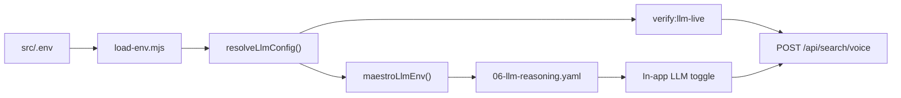

# LLM `.env` Automation Design

**Date:** 2026-07-06  
**Status:** Approved (OpenAI + OpenRouter for live tests; Groq/Gemini supported when keys present)

## Goal

Automation scripts read LLM keys from the consumer’s local `src/.env`, run live reasoning verification (API + optional Maestro F18), and skip cleanly when keys are absent — without bundling secrets into builds or CI.

## Consumer setup

```bash
cp src/.env.example src/.env
# Add at least one key:
#   OPENAI_API_KEY=sk-...
#   OPENROUTER_API_KEY=sk-or-...
```

Optional overrides (all supported in contract; tests run only when the matching key exists):

| Variable | Purpose |
|----------|---------|
| `OPENAI_API_KEY` | OpenAI live tests + Maestro |
| `OPENROUTER_API_KEY` | OpenRouter live tests + Maestro (preferred when both set) |
| `GROQ_API_KEY` | Groq provider (skip if unset) |
| `GEMINI_API_KEY` | Google Gemini (skip if unset) |
| `DEMO_LLM_PROVIDER` | Force provider: `openai` \| `openrouter` \| `groq` \| `gemini` \| `ollama` |
| `LLM_BASE_URL` | OpenAI-compatible base URL override |
| `LLM_MODEL` | Model override for API tests |
| `OLLAMA_BASE_URL` / `OLLAMA_MODEL` | Local Ollama (`verify:llm-local`) |

**Resolution order:** `process.env` → `src/.env` → skip with `WARN`.

**Policy unchanged:** keys never committed, never in CI secrets, never in APK/IPA.

## Architecture



### `load-env.mjs` extensions

- **`resolveLlmConfig()`** — returns `{ apiKey, provider, baseUrl?, model? }` using `DEMO_LLM_PROVIDER` or auto-detect (OpenRouter if `sk-or-`, else OpenAI, else first available Groq/Gemini key).
- **`maestroLlmEnv()`** — uses `resolveLlmConfig()` for `DEMO_LLM_API_KEY` + `DEMO_LLM_PROVIDER` label.
- **`hasClientLlmKey()`** — true if any of OpenAI, OpenRouter, Groq, Gemini keys set (Ollama uses separate local path).

### API gate — `verify:llm-live.mjs`

- Refactor to use `resolveLlmConfig()`.
- **Always run when OpenAI key present:** existing OpenAI conversational cases.
- **Always run when OpenRouter key present:** OpenRouter headphones case (WARN if 401, not FAIL if OpenAI passed).
- **When Groq/Gemini keys present:** one smoke case each; **skip with log line if key absent** (no failure).
- Failure labels: `[INFRA]` (401, timeout, network) vs `[PRODUCT]` (`intentSource !== llm`, zero matches).

### Runner integration

| Script | Keys present | Keys absent |
|--------|--------------|-------------|
| `run-e2e-all.mjs` | Spawn `verify:llm-live` before Maestro; run `06-llm-reasoning.yaml` on iOS/Android | `WARN llm-live: skipped` |
| `run-e2e-ios.mjs` | Same API gate; ML demo uses `maestroLlmEnv()` | WARN on optional ML |
| `run-e2e-android.mjs` | API gate only | WARN skip |

**Env:** `E2E_REQUIRE_LLM=1` → fail instead of skip (maintainer strict mode).

### Maestro F18 — `06-llm-reasoning.yaml`

New flow (does not change F17 rules-only `05-voice-llm.yaml`):

1. Login → Home
2. Enable `llm-reasoning-switch`
3. Tap provider matching `DEMO_LLM_PROVIDER` (default OpenRouter if key is `sk-or-`)
4. Paste key into `voice-api-key-input`
5. Query: `"it's a fifty dollars jacket blue please"`
6. Assert products visible (`Add` or results list)

Skipped entirely when `hasClientLlmKey()` is false.

## Testing plan (before commit)

1. `npm run verify:llm-live` — local API + OpenAI + OpenRouter keys (user has both)
2. `USE_CLOUD_API=1 npm run verify:cloud:llm` — Railway pass-through
3. `npm run verify:e2e-all:ios` — matrix + F18 when keys present
4. Temporarily empty keys → confirm WARN skip, no FAIL
5. `npm test` + `verify:secrets-policy`

## Non-changes

- F17 `05-voice-llm.yaml` stays rules-only
- No keys in demo APK or GitHub Actions
- Railway server env stays key-free (client pass-through only)

## Initial implementation scope

**Day one live tests:** OpenAI + OpenRouter only (keys user has today).  
**Contract + skip logic:** Groq + Gemini included in `.env.example` and `resolveLlmConfig()` for future consumers.

## Verification results (2026-07-06)

| Check | Result |
|-------|--------|
| `npm run test:scripts` | 8/8 PASS |
| `npm test` | 85/85 PASS |
| `verify:llm-live` (local) | 6/6 PASS — OpenAI + OpenRouter |
| `verify:cloud:llm` (Railway) | 6/6 PASS |
| `verify:e2e-ios:cloud` | PASS — llm-live + commerce |
| `verify:secrets-policy` | PASS |
| Groq/Gemini | Skipped (no keys in `src/.env`) |
| Maestro F18 UI | Scroll/layout flake — **WARN** when API `llm-live` passes |

Commands: `npm run verify:llm-live` · `USE_CLOUD_API=1 npm run verify:cloud:llm` · `E2E_REQUIRE_LLM=1 npm run verify:e2e-all`
